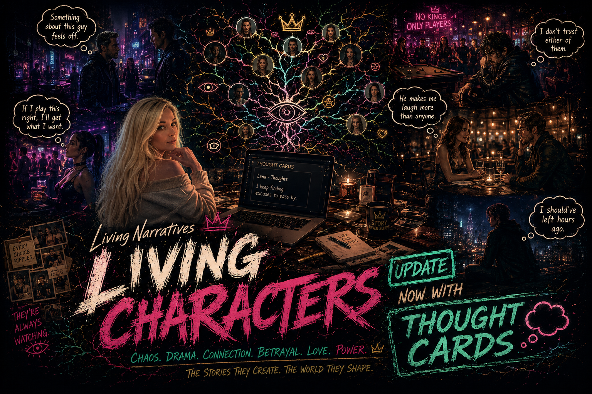

<div align="center">

# 🌱 Living Characters

### Autonomous NPC relationship simulation for AI Dungeon

**Living Characters doesn't write stories.**  
**It gives characters reasons to create stories themselves.**

[Installation](./installation.md) • [Configuration](./configuration.md) • [Pressure Presets Website](https://LivingNarratives.github.io/LivingCharacters) • [License](./LICENSE)

</div>

---

## 🎮 Try the Demo

Want to see it in action right away?

**[▶ Play the Living Characters Demo Scenario](https://play.aidungeon.com/scenario/BgA79ymBMXCC/living-characters?share=true&published=true)**

---

## ✨ What It Does

Living Characters adds two lightweight systems to AI Dungeon:

### 🌱 Life Cards

Life Cards create autonomous social threads between characters so your story world stops revolving only around the protagonist.

| Without Living Characters | With Life Cards |
| --- | --- |
| Everyone waits for the player. | NPCs develop their own drama. |
| Relationships reset constantly. | Life Cards preserve ongoing social threads. |
| The world feels reactive. | The world feels alive. |

### 💭 Thought Cards

Thought Cards are optional character thought journals.

They let selected characters privately form short thoughts that are saved to separate player-readable cards. These thoughts are for you to look back on later. They do not enter story context, do not affect Life Cards, and do not control character behavior.

| Without Thought Cards | With Thought Cards |
| --- | --- |
| Character thoughts disappear after the scene. | Thoughts are saved for later reading. |
| You only see what reaches the story. | You can peek at private reactions. |
| Inner lives are implied.                      | Characters leave little thought trails. |

---

## Setup Note

If you use Thought Cards, turn **Optimized Context** off in AI Dungeon.

Thought Cards are not compatible with AI Dungeon's Optimized Context feature.
Disable Optimized Context when using Thought Cards.

Thought Card numbers are permanent. Thoughts no longer renumber after rollover, and Thought Cards have no fixed 10-thought cap anymore.

New thoughts stay in Entry. Older thoughts roll into Notes, and Notes trims the oldest archived thoughts only when full. Thought Card contents are still not injected into story context.

---

## Troubleshooting

If AI Dungeon shows **"The AI service returned an empty response"**, update to the latest Living Characters library. The script now returns a zero-width fallback character when hidden/private output is stripped and nothing visible remains. This is meant to reduce empty-response errors, especially seen during Nova testing, without showing private Thought Card text to the player.

---

## 🌿 Characters Can Develop

| Relationships | Drama | Social Texture |
|---|---|---|
| Friendships | Rivalries | Gossip |
| Attraction | Betrayal | Avoidance |
| Trust | Jealousy | Grudges |
| Protectiveness | Conflict | Long-term arcs |

---

## 🎭 Example

**Without Living Characters**

```text
Jessica enters the room.

Everyone looks at Jessica.

Everyone waits for Jessica to do something.
```
